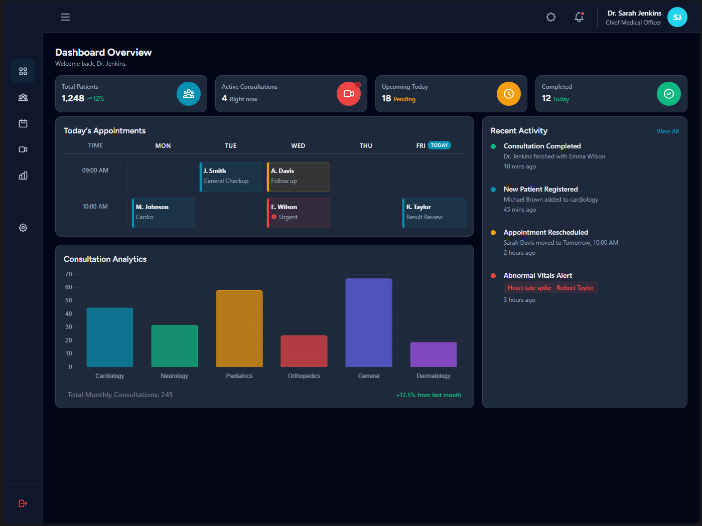

# 🏥 MediAdmin - Telemedicine Admin Dashboard

MediAdmin is a premium, high-performance administrative dashboard designed for telemedicine providers. It provides a centralized interface for managing patients, tracking real-time vitals, and analyzing consultation metrics with a sleek, modern UI.

## ✨ Key Features

- **📊 Comprehensive Dashboard**: At-a-glance overview of total patients, active consultations, and upcoming appointments.
- **📈 Advanced Analytics**: Interactive bar charts for consultation specialization analysis and volume tracking.
- **📅 Smart Calendar**: Dynamic weekly appointment scheduler with real-time "Today" tracking.
- **👥 Patient Management**: Full-featured patient directory with detailed profile viewing and search capabilities.
- **⚡ Real-time Vitals**: Live heart rate and vital signs monitoring integration (Teleconsultation module).
- **⚙️ Profile Settings**: Reactive account management allowing users to update profile details with instant global synchronization.
- **🌓 Adaptive Theme**: Seamless dark/light mode support for optimal viewing in any environment.

## 🛠️ Tech Stack

- **Framework**: [Angular 21](https://angular.io/) (Standalone Components, Signals)
- **Styling**: [Tailwind CSS 4.0](https://tailwindcss.com/)
- **Visualizations**: [Chart.js](https://www.chartjs.org/)
- **Icons**: Lucide & Heroicons
- **Build Tool**: Angular CLI & Vite
- **Testing**: [Vitest](https://vitest.dev/)

## 📄 License

This project is licensed under the MIT License - see the [LICENSE](LICENSE) file for details.

## 🤝 Contributing

Contributions are welcome! Please feel free to submit a Pull Request.

---
Built with ❤️ by [Ali Tamerr](https://github.com/Ali-Tamerr)
